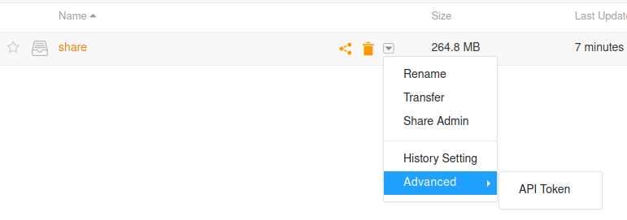

# Seafile-Fileshare
A tool to abuse seafile for quick n dirty filesharing 
 - integrates with the xdg-notification protocol for status and interaction
 - steals your login from your seaf-applet session and stores it into your keyring
 - to get shit to embed on discord I wrote a [liar](ttps://github.com/ToxicMushroom/discord-embed-links) that lies about content-length

## Help
Example call:
```
./seafile-fileshare 
    \ --file "/path/to/file.mp4"
    \ --host https://seafile.example.com
    \ --embed-host https://d.example.com
    \ --repo-token repo_api_token
    \ --repo-id uuid
    \ seafile_username
```

### Repo token
Get it right here:\


### Repo id
The thing in bold in the url bar when you're on a library's page:\
https:/\/seafile.example.com/library/**9c18d288-900a-43e3-8799-4deb33145cba**/share/

### Embed host
your instance of https://github.com/ToxicMushroom/discord-embed-links

### Host
your https://www.seafile.com/en/home/ instance